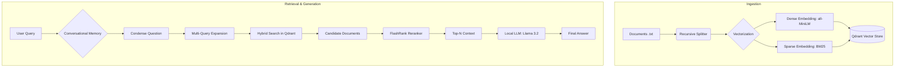

# 🚀 Advanced Local Conversational RAG

An enterprise-grade, fully local Retrieval-Augmented Generation (RAG) system built with **LangChain**, **Qdrant**, and **Ollama**. This project implements advanced retrieval techniques to provide highly accurate, context-aware answers from private documentation.

---

## 🏗️ Architecture Diagram



## 🌟 Key Features

-   **🧠 Conversational Memory**: Managed through a "Condense Question" pipeline, allowing the system to handle follow-up questions effectively.
-   **🔍 Advanced Retrieval (Multi-Query)**: Automatically generates multiple variations of user queries to overcome vocabulary mismatch and improve document recall.
-   **⚡ Hybrid Search**: Combines Dense (Semantic) and Sparse (BM25) search for the highest precision in document retrieval.
-   **🎯 FlashRank Reranking**: Utilizes a lightweight cross-encoder to re-score and prioritize the most relevant documents before generation.
-   **🛡️ Privacy-First (Fully Local)**: Designed to run entirely on-premise using **Ollama** (Llama 3.2) and local HuggingFace embeddings. Zero data leaks, zero API costs.
-   **📊 RAGAS Evaluation**: Includes a pre-configured evaluation suite to measure performance using industry-standard metrics (Faithfulness, Context Precision).

---

## 🏗️ Architecture

### 1. Ingestion Pipeline
- **Parsing**: Loads `.txt` documentation with rich metadata.
- **Chunking**: Uses `RecursiveCharacterTextSplitter` for semantic coherence.
- **Vectorization**: Creates both Dense and Sparse embeddings stored in **Qdrant**.

### 2. Inference Pipeline (Chat)
- **Question Re-writing**: Contextualizes user input based on chat history.
- **Expansion**: Generates 3+ query variations via local LLM.
- **Retrieval**: Hybrid search + MMR (Maximum Marginal Relevance).
- **Refinement**: Re-ranks candidates via **FlashRank**.
- **Generation**: Responses generated with streaming output and source citations.

---

## 🛠️ Tech Stack

- **Framework**: [LangChain](https://www.langchain.com/)
- **Vector DB**: [Qdrant](https://qdrant.tech/)
- **LLM Engine**: [Ollama](https://ollama.com/) (Llama 3.2)
- **Embeddings**: HuggingFace (`all-MiniLM-L6-v2`) & FastEmbed (BM25)
- **Reranker**: [FlashRank](https://github.com/prithvida/flashrank)
- **Evaluation**: [RAGAS](https://docs.ragas.io/)

---

## ⚙️ Installation

### 1. Prerequisites
- Python 3.12+
- [Ollama](https://ollama.com/) installed and running.
- [Qdrant](https://qdrant.tech/documentation/quick-start/) (Local instance or Cloud).

### 2. Setup
Clone the repository and install dependencies using [uv](https://github.com/astral-sh/uv):
```bash
uv sync
```
*Alternatively, using standard pip:*
```bash
pip install .
```

### 3. Environment Variables
Copy the template and fill in your details:
```bash
cp .env.example .env
```

### 4. Pull Local Model
```bash
ollama pull llama3.2
```

---

## 🚀 Usage

### 1. Ingest Documentation
Place your `.txt` files in the `data/` directory, then run:
```bash
python src/ingest.py
```

### 2. Start Chatting (CLI)
Launch the conversational interface in your terminal:
```bash
python src/app.py
```

### 3. Launch Web Interface (Streamlit)
For a modern, user-friendly experience:
```bash
streamlit run src/streamlit_app.py
```

### 4. Run Evaluation
Measure system quality with RAGAS:
```bash
python src/evaluate.py
```

---

## 📜 License
This project is licensed under the MIT License - see the LICENSE file for details.
