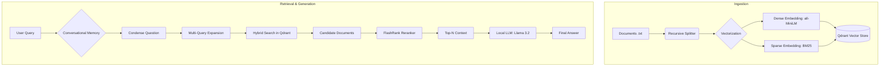

# Advanced Local Conversational RAG

An enterprise-grade, fully local Retrieval-Augmented Generation (RAG) system built with **LangChain**, **Qdrant**, and **Ollama**. This project implements advanced retrieval techniques to provide highly accurate, context-aware answers from private documentation.

---

## 🏗️ Architecture Diagram



## 🌟 Key Features

- **🧠 Conversational Memory**: Managed through a "Condense Question" pipeline for effective context handling.
- **🔍 Advanced Retrieval (Multi-Query)**: Automatically generates query variations via local LLM to improve recall.
- **⚡ Hybrid Search**: Combines Dense (Semantic) and Sparse (BM25) search for high precision.
- **🎯 FlashRank Reranking**: Prioritizes relevant context using lightweight cross-encoders.
- **🛡️ Resource Management**:
    - **One-Click Shutdown**: Streamlit UI button to kill the server and free RAM/CPU instantly.
    - **Proactive GC**: Explicit garbage collection during evaluation to prevent memory pressure.
- **📊 Professional Evaluation**: "Student-Professor" architecture using RAGAS to measure quality objectively.

---

## 🏗️ System Architecture

1.  **Ingestion**: `ingest.py` loads documentation, chunks text, and populates **Qdrant**.
2.  **Retrieval**: Hybrid Search (Dense + Sparse) retrieves candidates.
3.  **Reranking**: `FlashrankRerank` re-orders candidates for quality.
4.  **Generation (Student)**: **Llama 3.2** provides fast, context-aware answers.
5.  **Assessment (Teacher)**: **Llama 3.1 8B** acts as a Judge to verify the quality of generation.

---

## 🛠️ Tech Stack

- **Framework**: [LangChain](https://www.langchain.com/)
- **Vector DB**: [Qdrant](https://qdrant.tech/)
- **LLM Engine**: [Ollama](https://ollama.com/) (Llama 3.2 & 3.1 8B)
- **Embeddings**: HuggingFace (`all-MiniLM-L6-v2`) & FastEmbed (BM25)
- **Reranker**: [FlashRank](https://github.com/prithvida/flashrank)
- **Evaluation**: [RAGAS](https://docs.ragas.io/)
- **Package Manager**: [uv](https://github.com/astral-sh/uv)

---

## ⚙️ Setup & Installation

1.  Install [uv](https://github.com/astral-sh/uv).
2.  Install dependencies:
    ```bash
    uv sync
    ```
3.  Configure your `.env` following `.env.example`.
4.  Pull Local Models:
    ```bash
    ollama pull llama3.2    # Student (Fast Generation)
    ollama pull llama3.1:8b # Teacher (Reliable Evaluation)
    ```

---

## Usage

### 1. Ingest Data
```bash
uv run python src/ingest.py
```

### 2. Chat Web UI (Streamlit)
```bash
uv run streamlit run src/streamlit_app.py
```
*Note: Use the **"Exit & Shutdown"** button in the sidebar to release all RAM/CPU when finished.*

### 3. Run Evaluation (Student-Professor Model)
```bash
uv run python src/evaluate.py
```

---

## 📊 Evaluation Methodology

Developed for rigorous quality control:
- **Student**: `llama3.2` (3B) - Fast and lightweight for real-time interaction.
- **Teacher**: `llama3.1:8b` - High-precision reasoning used to score the Student's responses.

**Metrics:**
- **Faithfulness**: Verifies if the answer is grounded in the retrieved documents (anti-hallucination).
- **Context Precision**: Evaluates the quality of the document retrieval phase.


---

## 📜 License
This project is licensed under the MIT License - see the LICENSE file for details.
