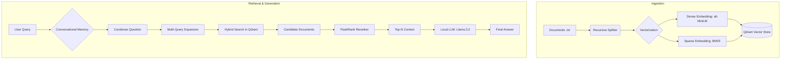

# Advanced Local Conversational RAG

A Retrieval-Augmented Generation system designed around **data sovereignty and privacy**. Every component of the pipeline — LLM inference, embeddings, reranking — runs locally on your hardware through Ollama and HuggingFace models. No document content, no query, no conversation ever leaves your machine.

This matters when you're working with internal company documents, personal data, legal files, or anything you wouldn't paste into a third-party API. Traditional RAG setups send your private chunks to external LLM providers for embedding and generation. This system doesn't.

The architecture combines hybrid search, multi-query expansion, and cross-encoder reranking to maintain retrieval quality without relying on cloud APIs. Cloud providers (Gemini, OpenRouter) are available as optional fallbacks, but the default configuration is fully local and self-contained.

---

## Architecture


```mermaid
graph TD
    subgraph Ingestion
        A[Documents .txt] --> B(Recursive Splitter)
        B --> C{Vectorization}
        C --> D[Dense Embedding: all-MiniLM]
        C --> E[Sparse Embedding: BM25]
        D --> F[(Qdrant Vector Store)]
        E --> F
    end

    subgraph Retrieval & Generation
        G[User Query] --> H{Conversational Memory}
        H --> I[Condense Question]
        I --> J[Multi-Query Expansion]
        J --> K[Hybrid Search in Qdrant]
        K --> L[Candidate Documents]
        L --> M[FlashRank Reranker]
        M --> N[Top-N Context]
        N --> O[Local LLM: Llama 3.2]
        O --> P[Final Answer]
    end
```

## Why Local?

Most RAG implementations rely on external APIs (OpenAI, Anthropic, Google) for embeddings and generation. That means every document chunk you index and every question you ask gets sent to third-party servers. For many use cases — corporate knowledge bases, HR policies, legal contracts, medical records, financial data — that's a non-starter.

This system keeps everything on-premise:
- **LLM inference** runs on Ollama (Llama 3.2) — no API calls for generation
- **Embeddings** are computed locally via HuggingFace (`paraphrase-multilingual-MiniLM-L12-v2`) — your documents are never sent to external embedding services
- **Reranking** uses a local ONNX model (FlashRank TinyBERT) — no cloud cross-encoders
- **Vector storage** can run locally via Docker (Qdrant) — your vectors stay on your infrastructure

The only network traffic is between your machine and your own Qdrant instance.

---

## Features

- **Conversational Memory** — reformulates follow-up questions into standalone queries using chat history
- **Multi-Query Expansion** — generates query variations via LLM to improve retrieval recall
- **Hybrid Search** — combines dense (semantic) and sparse (BM25) retrieval in Qdrant
- **FlashRank Reranking** — re-orders candidates with a lightweight cross-encoder (TinyBERT)
- **RAGAS Evaluation** — automated quality scoring with Faithfulness and Context Precision metrics
- **Multilingual** — uses cross-language embeddings, so you can query in any language regardless of document language
- **Dual interface** — CLI (`app.py`) and web UI (`streamlit_app.py`)

---

## Tech Stack

| Component | Tool |
|-----------|------|
| Framework | [LangChain](https://www.langchain.com/) |
| Vector DB | [Qdrant](https://qdrant.tech/) |
| LLM | [Ollama](https://ollama.com/) (Llama 3.2 gen, Llama 3.1 8B eval) |
| Embeddings | HuggingFace `paraphrase-multilingual-MiniLM-L12-v2` + FastEmbed BM25 |
| Reranker | [FlashRank](https://github.com/prithvida/flashrank) |
| Evaluation | [RAGAS](https://docs.ragas.io/) |
| Package Manager | [uv](https://github.com/astral-sh/uv) |

---

## Prerequisites

- Python >= 3.12
- [uv](https://github.com/astral-sh/uv) installed
- [Ollama](https://ollama.com/) running locally (`ollama serve`)
- A Qdrant instance (cloud or local via Docker)

## Setup

1. Install dependencies:
    ```bash
    uv sync
    ```

2. Copy `.env.example` to `.env` and fill in your values:
    - `QDRANT_URL` and `QDRANT_API_KEY` are **required**
    - LLM provider keys are optional if using Ollama locally

3. Pull the local models:
    ```bash
    ollama pull llama3.2       # generation
    ollama pull llama3.1:8b    # evaluation judge
    ```

4. Verify Ollama is running:
    ```bash
    ollama list
    ```

---

## Usage

### Ingest documents
```bash
uv run python src/ingest.py
```

### Chat (Web UI)
```bash
uv run streamlit run src/streamlit_app.py
```

### Chat (CLI)
```bash
uv run python src/app.py
```

### Run evaluation
```bash
uv run python src/evaluate.py
```

---

## Evaluation

The system uses a "Student-Teacher" approach:
- **Student** (`llama3.2`): generates answers during normal usage
- **Teacher** (`llama3.1:8b`): scores the student's responses during evaluation

Metrics:
- **Faithfulness**: is the answer grounded in the retrieved documents?
- **Context Precision**: were the retrieved documents actually relevant?

Results are saved as JSON in `eval_results/`.

---

## Troubleshooting

| Problem | Solution |
|---------|----------|
| `ConnectionRefusedError` on Ollama | Make sure `ollama serve` is running |
| Qdrant connection fails | Check `QDRANT_URL` and `QDRANT_API_KEY` in `.env` |
| Slow first query | Normal — models are loaded into memory on first use |
| Out of memory | Use smaller models or reduce `RETRIEVER_K` in `rag_pipeline.py` |

---

## License

MIT License — see the LICENSE file for details.
